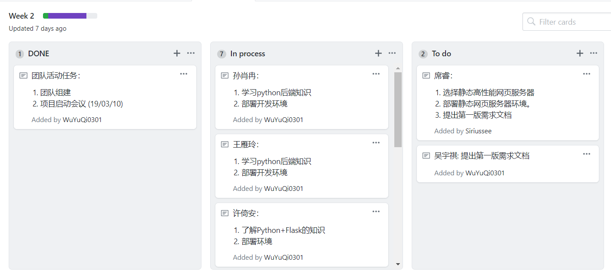
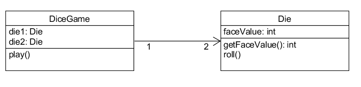

# Homework 2

## 1. 简答题

- 用简短的语言给出对分析、设计的理解。

分析：对问题及其需求的研究，在问题的领域中找到并描述符合需求的对象或者说，概念。

设计：找到满足需求解决问题的概念上的解决办法，定义软件对象以及他们如何互相协作。

- 用一句话描述面向对象的分析与设计的优势。

不需要作为语言专家，用特定的语言来描述问题，因此分析与设计的人与实现的人可以用一种普遍的表达来沟通。

- 简述 UML（统一建模语言）的作用。考试考哪些图？

作用：简单快速地将设计与分析的结果图形化。

概念的类图。

- 从软件本质的角度，解释软件范围（需求）控制的可行性

因为软件本质上是复杂、不可见、不一致、可变的，因此对软件范围进行控制，即是围绕客户目标，将客户模糊的需求确定下来，发现并满足客户感兴趣的内容，舍弃无用且复杂的内容，不做无用功，不做臃肿的软件。

## 2. 项目管理实践

- 看板使用练习（提交看板执行结果贴图，建议使用 Git project）

- UML绘图工具练习（提交贴图，必须使用 UMLet）

教材第2版 P10 Figure 1.5
